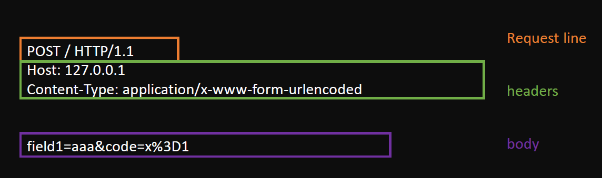
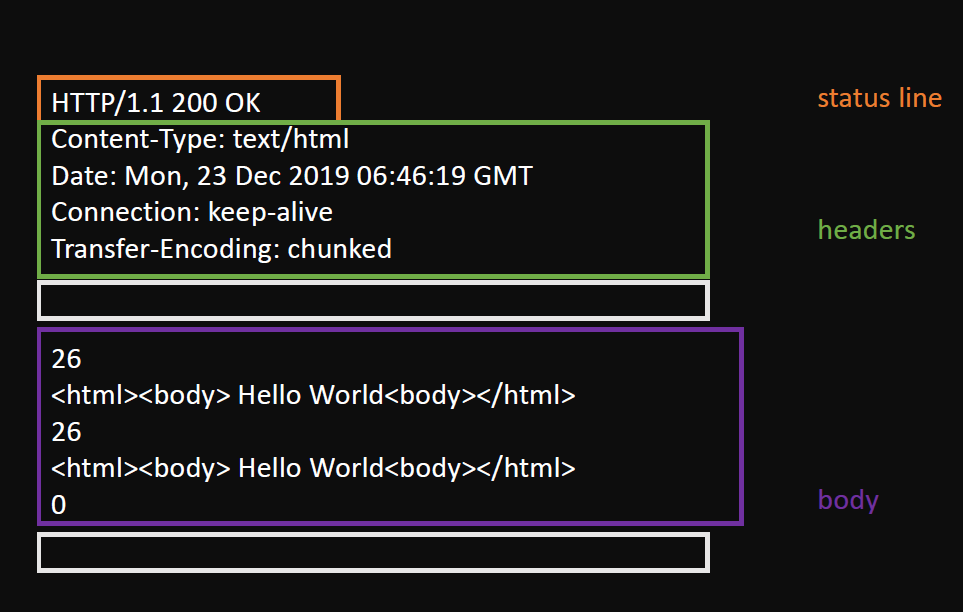
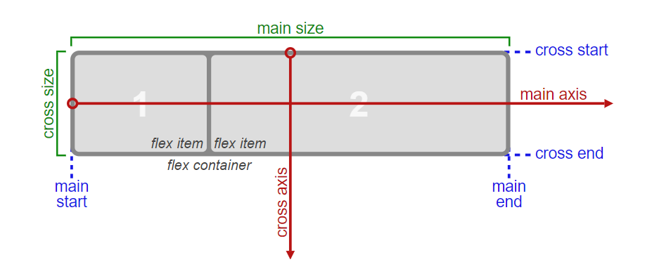

# 玩具浏览器

该项目用于开发一款玩具浏览器。


## HTTP

[rfc2616 标准](https://tools.ietf.org/html/rfc2616#section-6)

该标准中，用 `\r\n`表示 `CRLF`。在使用老式的机械打字机时，如果你想在下一行最左端开始继续打印，需要做两个动作：

1. CR: `\r`，先把机头重新推回最左侧，回到行首，这就是回车。
2. LF: `\n`，但是他还没有换行，然后再按一下换行键，使他往下移动一行，代表换行。

计算机刚产生的时候，主要还是文字界面，受打字机影响，也就有了这两个特殊字符。

### Request

```text
Request = Request-Line
          *(( general-header
            | request-header
            | entity-header ) CRLF)
          CRLF
          [ message-body ]
```



### Response



## Parse

[HTML 标准](https://html.spec.whatwg.org/multipage/parsing.html#tokenization)

生成 DOM 树：

1. 使用状态机生成各个 token
2. 将 token 赋给 element
3. 将 element 放入 stack 中

## CSS Computing

浏览器中，都是先收集到所有的 CSS 规则，然后再应用给 DOM。如果之后读取的流导致 CSS 规则变了，会引起 CSS 规则重新计算，然后重新再应用给 DOM，进而引起重排和重绘。

将 CSS 挂载到 DOM 树上:

1. 收集 CSS 规则

   遇到 `</style>` 时， 将栈顶 children 中的 TextNode 中的 content 加到 CSS 规则里

2. 添加调用

   在生成一个新的 element 的时候，立即添加生成 CSS

3. 获取父元素序列
4. 拆分选择器
5. 计算选择器与元素的匹配关系
6. 在 element 上生成 computedStyle 属性
7. 确定规则覆盖关系

## Layout

说白了就是计算各个元素的位置。

Layout 可分为三代技术：

1. normal flow + float + position
2. **flex**
3. grid

本项目实现了 flex。



flex 涉及的主要概念有：

- `flex container`：属性 `display: flex;` 的元素，元素当作一个容器
- `flex item`：flex container 中的各个元素
- `main axis`：flex container 中, flex items 的排布方向
- `main-start`：flex container 中，flex items 沿主轴方向排布的开始位置
- `main-end`：flex container 中，flex items 沿主轴方向排布的结束位置
- `main-space`：flex container 中，flex items 沿主轴方向初始排布后，主轴方向的剩余尺寸
- `main-size`：flex item 占据主轴方向的尺寸
- `main-sign`：下一个 flex item 沿主轴方向的前进符号，分为 + 和 -
- `main-base`：下一个 flex item 沿主轴方向的基点

与 main axis 对应的概念还有 cross axis，表示交叉轴，它的理解方式与主轴一样。

flex container 的常用属性有：

- `flex-direction`：建立主轴，确定 flex items 的排布方向。
- `flex-wrap`：根据这个属性，确定 flex items 在一行内排布时，是重新开一个行，还是强行挤在原来的行里。
- `flex-flow`：`flex-direction` 和 `flex-wrap` 两者结合的语法糖。
- `justify-content`：确定当前行中，flex items 在主轴方向上的对齐方式，比如两端对齐等。会涉及到 `main-space`。
- `align-items`：确定当前行中，flex items 在交叉轴方向上的对齐方式，比如顶对齐、底对齐等。
- `align-content`：当有多个行时，多个行之间如果有空格，多个行在交叉轴方向上的对齐方式。也就是**确定行与行的对应关系**。

flex item 的常用属性有：

- `order`：当前 item 在当前行的出现次序
- `flex-grow`：当前 item 在当前行的的放大比例。如果所有项目的 `flex-grow` 属性都为 1，则它们将等分剩余空间（如果有的话）。如果一个项目的 `flex-grow` 属性为 2，其他项目都为 1，则前者占据的剩余空间将比其他项多一倍。
- `flex-shrink`: 当前 item 的缩小比例。如果所有项目的 `flex-shrink` 属性都为 1，当空间不足时，都将等比例缩小。如果一个项目的 `flex-shrink` 属性为 0，其他项目都为 1，则空间不足时，前者不缩小。
- `flex-basis`：当前 item 的 main size
- `flex`：是 `flex-grow`, `flex-shrink` 和 `flex-basis` 的语法糖
- `align-self`：当前 item 在交叉轴方向上的对齐方式，比如顶对齐、底对齐等。可参考 flex container 的 `align-items` 属性

可参考 [a-guide-to-flexbox](https://css-tricks.com/snippets/css/a-guide-to-flexbox/#flexbox-background)。

实现步骤：

1. 定义主轴、交叉轴
2. 收集元素进行
3. 计算主轴
4. 计算交叉轴

## Render

1. 绘制单个元素
2. 绘制 DOM
