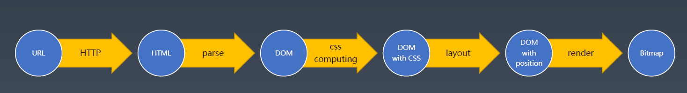

# 玩具浏览器

该项目用于开发一款玩具浏览器。



## 浏览器获得返回的 HTML

[rfc2616 标准](https://tools.ietf.org/html/rfc2616#section-6)

- Request

  ```text
  POST / HTTP/1.1
  X-Foo2: customed
  Content-Type: application/x-www-form-urlencoded
  Content-Length: 18

  name=winter&age=18

  ```

- Response

  ```text
  HTTP/1.1 200 OK
  Content-Type: text/plain
  X-Foo: bar
  Date: Fri, 15 May 2020 06:20:07 GMT
  Connection: keep-alive
  Transfer-Encoding: chunked

  2
  ok
  0
  ```

## 浏览器生成 DOM

[HTML 标准](https://html.spec.whatwg.org/multipage/parsing.html#tokenization)
